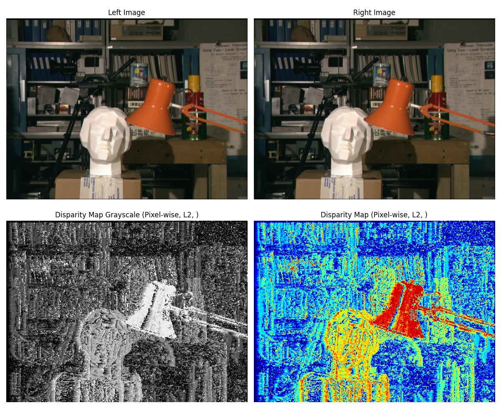
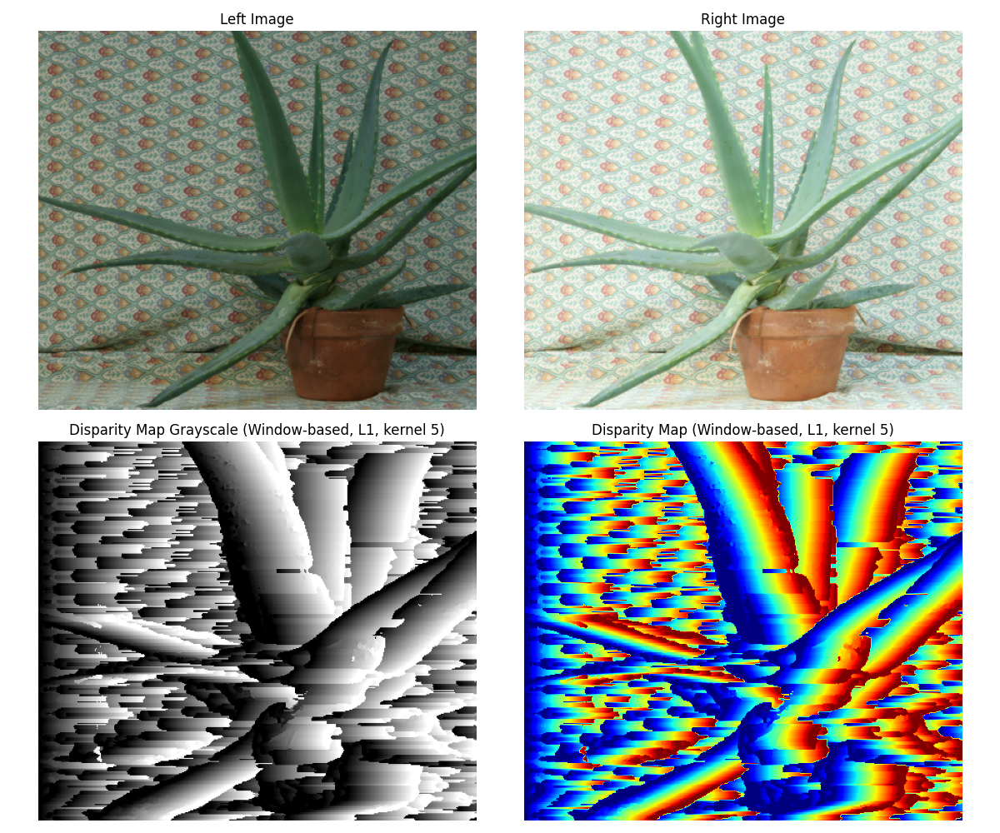
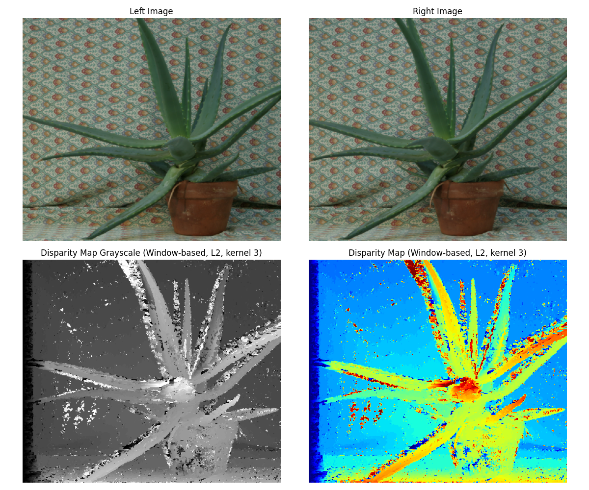

# Stereo Matching Depth Estimation

## Overview
This project focuses on depth estimation from stereo images using various stereo matching techniques. The goal is to generate accurate disparity maps that can be used for 3D reconstruction, autonomous vehicles, and other applications requiring depth information.

## Feature
- **Pixel-wise Matching**: Implemented methods include:
    - Sum of Absolute Differences
    - Sum of Squared Differences
- **Window-based Matching**: 
    - Enhanced pixel-wise matching by considering a window of neighboring pixels
    - Optimized using matrix convolution for fast processing
- **Cosine Similarity**: Measured similarity between image patches as an alternative matching cost function
- **Disparity Map Generation**: Produced detailed disparity maps for depth estimation
- **Visualization**: Includes tools for visualizing the results using OpenCV and Matplotlib

## Requirements:
- Python
- OpenCV for image processing
- Matplotlib for visualization

## Project Structure
```bash
Stereo-Matching-Depth-Estimation/
├── data/                   # Contains stereo image pairs for testing
├── src/                    # Source code implementing the matching techniques
│   ├── pixel_wise_matching.py
│   ├── window_based_matching.py
│   ├── cosine_similarity.py
│   └── similarity.py       # Similarity metrics
├── assets/                 # Results including disparity maps
└── README.md               # Project documentation
```

## Installation
**Clone the repository**:
```bash
git clone https://github.com/toan-ly/Stereo-Matching-Depth-Estimation.git
cd Stereo-Matching-Depth-Estimation
```

**Run the following script to get the results**
```bash
python main.py
```

## Results
Disparity maps generated from various matching techniques are stored in the `assets/` directory. Below are some examples:





